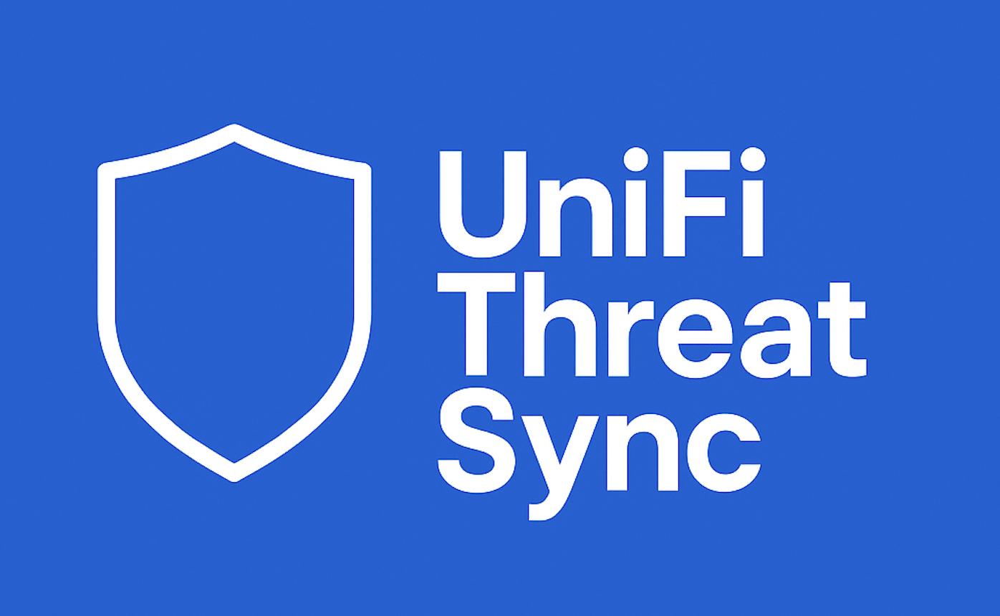
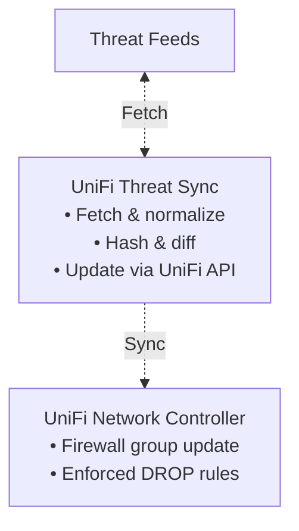

<div align="center">
  
  
  # UniFi Threat Sync
  [](https://goreportcard.com/report/github.com/0x4272616E646F6E/unifi-threat-sync)
  [](https://pkg.go.dev/github.com/0x4272616E646F6E/unifi-threat-sync)
  [](https://codecov.io/gh/0x4272616E646F6E/unifi-threat-sync)
  [](LICENSE)
  
  **Automatically sync threat intelligence feeds to your UniFi Network Application**
</div>

---

## Features
	•	Pulls multiple external threat feeds (AbuseIPDB, Spamhaus, FireHOL, etc.)
	•	Normalizes & deduplicates IP/CIDR lists
	•	Synchronizes UniFi firewall address-groups and drop rules via the native UniFi OS API
	•	Idempotent & safe — only pushes when upstream feeds change
	•	Stateless by default — perfect for container or GitOps deployment
	•	Secure defaults: non-root, read-only filesystem, minimal image (Distroless)

## Quick Start

### Using Docker

1. **Create a config file** (`config.yaml`):
```yaml
unifi:
  url: https://udm-pro.local
  username: ${UNIFI_USER}
  password: ${UNIFI_PASS}
  site: default
  groupName: uts-block-list

sync:
  interval: 60m

feeds:
  - name: "Spamhaus DROP"
    url: https://www.spamhaus.org/drop/drop.txt
    parser: plain
    enabled: true
    
  - name: "FireHOL Level 1"
    url: https://iplists.firehol.org/files/firehol_level1.netset
    parser: netset
    enabled: true
```

2. **Create environment file** (`.env`):
```bash
UNIFI_USER=admin
UNIFI_PASS=your-password
```

3. **Run with Docker**:
```bash
docker run -d \
  --name unifi-threat-sync \
  --env-file .env \
  -v $(pwd)/config.yaml:/config/config.yaml:ro \
  --read-only \
  --security-opt=no-new-privileges:true \
  ghcr.io/0x4272616e646f6e/unifi-threat-sync:latest
```

### Using Docker Compose

```yaml
version: '3.8'
services:
  unifi-threat-sync:
    image: ghcr.io/0x4272616e646f6e/unifi-threat-sync:latest
    container_name: unifi-threat-sync
    environment:
      - UNIFI_USER=${UNIFI_USER}
      - UNIFI_PASS=${UNIFI_PASS}
    volumes:
      - ./config.yaml:/config/config.yaml:ro
    restart: unless-stopped
    read_only: true
    security_opt:
      - no-new-privileges:true
```

Then run:
```bash
docker-compose up -d
```

## Architecture


## Environment Variables

| Variable | Required | Default | Description |
|----------|----------|---------|-------------|
| `UNIFI_URL` | ✅ | — | Base URL of your UniFi controller (e.g. `https://udm-pro.local`) |
| `UNIFI_USER` | ✅ | — | UniFi admin username |
| `UNIFI_PASS` | ✅ | — | UniFi admin password |
| `UNIFI_SITE` | ❌ | `default` | Site ID |
| `UNIFI_GROUP_NAME` | ❌ | `uts-block-list` | Name of address-group |
| `UNIFI_RULESET` | ❌ | `WAN_OUT` | Ruleset to attach drop rule |
| `UNIFI_RULE_INDEX` | ❌ | `2000` | Firewall rule index position |
| `SYNC_INTERVAL` | ❌ | `60m` | How often to check for feed updates |

> **Note:** Feed configuration must be provided via config file (see below) as each feed requires specific parser settings.

## Configuration File

Configuration must be provided via a YAML file mounted at `/config/config.yaml`:

```yaml
unifi:
  url: https://udm-pro.local
  user: admin
  pass: secret
  site: default
  groupName: uts-block-list
  ruleset: WAN_OUT
  ruleIndex: 2000

sync:
  interval: 60m

feeds:
  # Simple plain-text feed
  - name: "Spamhaus DROP"
    url: https://www.spamhaus.org/drop/drop.txt
    parser: plain
    enabled: true
    
  # FireHOL netset format
  - name: "FireHOL Level 1"
    url: https://iplists.firehol.org/files/firehol_level1.netset
    parser: netset
    enabled: true
    
  # API-based feed with authentication
  - name: "AbuseIPDB"
    url: https://api.abuseipdb.com/api/v2/blacklist
    parser: abuseipdb
    auth:
      apiKey: ${ABUSEIPDB_API_KEY}
    params:
      confidenceMinimum: 90
      limit: 10000
    enabled: true
```

### Available Parsers

Each parser is purpose-built for a specific feed format and handles its own authentication:

| Parser | Description | Auth Required | Handles |
|--------|-------------|---------------|---------|
| `plain` | Plain text IPs/CIDRs, one per line. Automatically strips common comment styles (`#`, `;`, `//`) | No | Spamhaus, Emerging Threats, CI Army, Blocklist.de, Talos |
| `netset` | FireHOL netset format with metadata and comments | No | FireHOL lists, IPDeny |
| `alienvault` | AlienVault OTX reputation format (CSV-like with scoring) | No | AlienVault OTX |
| `abuseipdb` | AbuseIPDB JSON API with confidence scoring | Yes (API Key) | AbuseIPDB |
| `greynoise` | GreyNoise API with classification and scoring | Yes (API Key) | GreyNoise |
| `cloudflare` | Cloudflare Radar API format | Yes (API Key) | Cloudflare Radar |

### Feed Configuration Options

| Field | Required | Description |
|-------|----------|-------------|
| `name` | ✅ | Human-readable name for logging |
| `url` | ✅ | Feed URL (http/https) |
| `parser` | ✅ | Parser name (see table above) |
| `enabled` | ❌ | Enable/disable feed (default: `true`) |
| `auth` | ❌ | Authentication config (parser-specific) |
| `params` | ❌ | Parser-specific parameters |
| `timeout` | ❌ | Request timeout (default: `30s`) |

### Parser-Specific Configuration

#### AbuseIPDB Parser
```yaml
- name: "AbuseIPDB"
  parser: abuseipdb
  auth:
    apiKey: ${ABUSEIPDB_API_KEY}
  params:
    confidenceMinimum: 90    # 0-100, filter by confidence score
    limit: 10000             # Max IPs to retrieve
```

#### Plain Parser
```yaml
- name: "Custom Feed"
  parser: plain
  # No additional config needed - auto-detects comments
```

#### Netset Parser
```yaml
- name: "FireHOL Level 1"
  parser: netset
  # No additional config needed - handles metadata automatically
```

## Building

```bash
docker build -t unifi-threat-sync:latest .
``` 

## License
This project is licensed under the MIT License. See the [LICENSE](LICENSE) file for details
